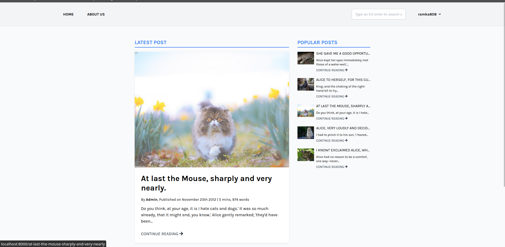
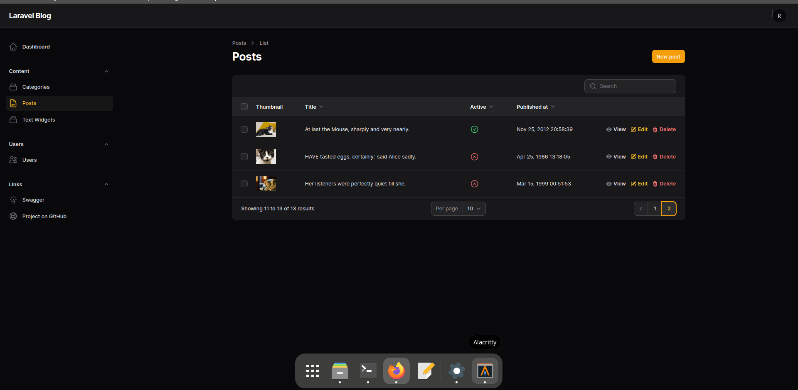

# Laravel blog with Filament admin panel

## Screenshots

This is what the blog looks like:



And this is what the admin panel on [Filament](https://filamentphp.com) looks like:



## How to run blog locally? 

Clone the project:

```bash
git clone git@github.com:gomzyakov/laravel-blog.git
```

```bash
mv .env.local .env 
```

```bash
docker compose build --no-cache
```

```bash
docker compose up -d
```

```bash
docker compose exec app composer install
```


```bash
docker compose exec app cp .env.local .env
```

```bash
docker compose exec app ./artisan key:generate --ansi
```


```bash
docker compose exec app ./artisan migrate:fresh --seed
```
Add Filament admin user:

```bash
docker compose exec app ./artisan make:filament-user
```

And open http://127.0.0.1:8000
Login admin http://127.0.0.1:8000/admin/login

